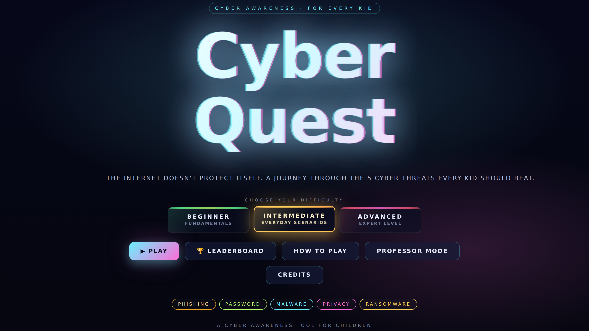
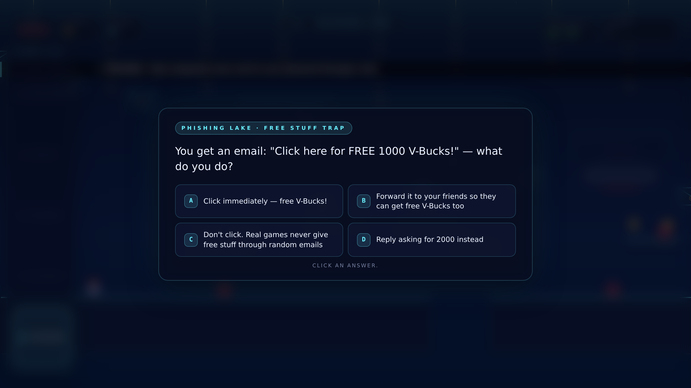
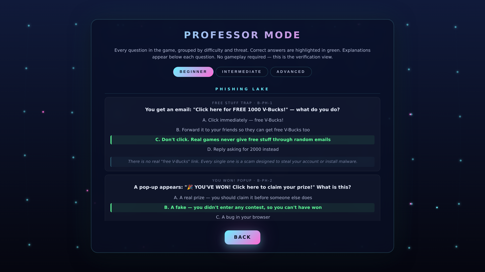
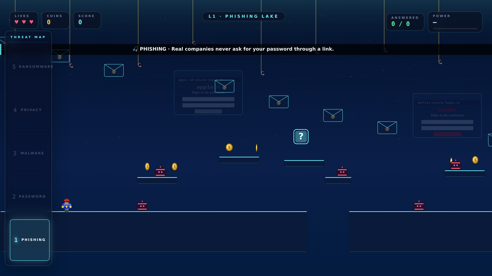

# Cyber Quest

A cyber-awareness platformer for children. Kids run through five worlds and learn to spot phishing, build strong passwords, avoid malware, protect their privacy, and handle ransomware. Play it in the browser, no install:

**https://halkuwaiti.github.io/cyber-quest/**

---

## What it teaches

Five worlds, one threat each.

| # | World | What kids learn |
|---|---|---|
| 1 | Phishing Lake | Fake senders, bait messages, suspicious links |
| 2 | Password Castle | Strong passwords, reuse, two-factor |
| 3 | Malware Forest | Downloads, fake apps, pop-ups |
| 4 | Privacy Plaza | Oversharing, location, strangers online |
| 5 | Ransomware Vault | Backups, locked files, what to do next |

Along the way you hit question blocks. A right answer gives you a power-up. A wrong answer costs you something and then shows you the correct answer with a one-line reason, so the mistake teaches.

---

## Three levels of difficulty

Same 15 question slots, three separate question banks, 45 questions in total.

- **Beginner** covers the vocabulary, aimed at ages 8 to 10
- **Everyday scenarios** puts kids in situations they actually meet, aimed at ages 10 to 13
- **Advanced** goes into the harder cases, good for older kids and parents

A teacher or parent can open the question bank from the title screen and read all 45 questions and answers without playing.

---

## How to play

| Action | Keys |
|---|---|
| Move | Left and right arrows |
| Jump | Space or up arrow. Hold for a higher jump, tap again in the air for a double jump |
| Answer | Click the answer |
| Pause | Esc |
| Mute | M |

It needs a keyboard, so use a laptop or a desktop.

---

## Running a session with a group

One run takes about 10 to 15 minutes. In a classroom or at a stand it works well with one child on the keyboard and the rest calling out answers, since every question is a discussion. At the end each player gets a report card with a grade and a breakdown of which threats they handled well.

---

## Privacy and safety

- The game makes no network requests at all. `index.html` sets `connect-src 'none'` in its Content Security Policy, so the page is blocked from calling out even if something tried.
- It collects nothing and sends nothing. Scores stay in the browser on that one computer.
- There are no accounts, no sign-in, and no third-party scripts or trackers.
- All the code is in this repository and it is plain readable JavaScript, so you can check any of the above yourself.

---

## Built with

Plain JavaScript on an HTML5 canvas. No game engine, no framework, no build step. Sound is generated at runtime with the Web Audio API, so there are no audio files. About 5,500 lines across 15 files in `src/`.

There is also a desktop version wrapped in Electron for running offline at an exhibition stand.

---

## Where it has been shown

Exhibited at **Make it in the Emirates 2026**, ADNEC Abu Dhabi, where children played it at the stand.

---

## Partner builds

The title screen, tagline, accent color and splash all come from one file, `src/whitelabel.js`, so the game can carry an organization's branding with no rebuild. A partner splash is turned on by adding `?partner=` to the URL, which keeps the public page unbranded.

---

## Credits and license

Design and engineering by **Hamad Alkuwaiti**.

Licensed **CC BY-NC 4.0**. Free to use, share and adapt for education and other non-commercial work, with credit. For commercial use, get in touch.
